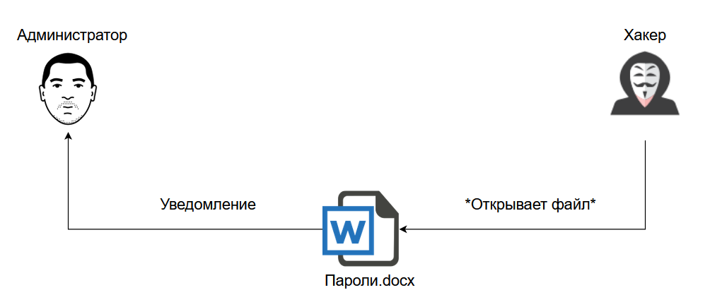
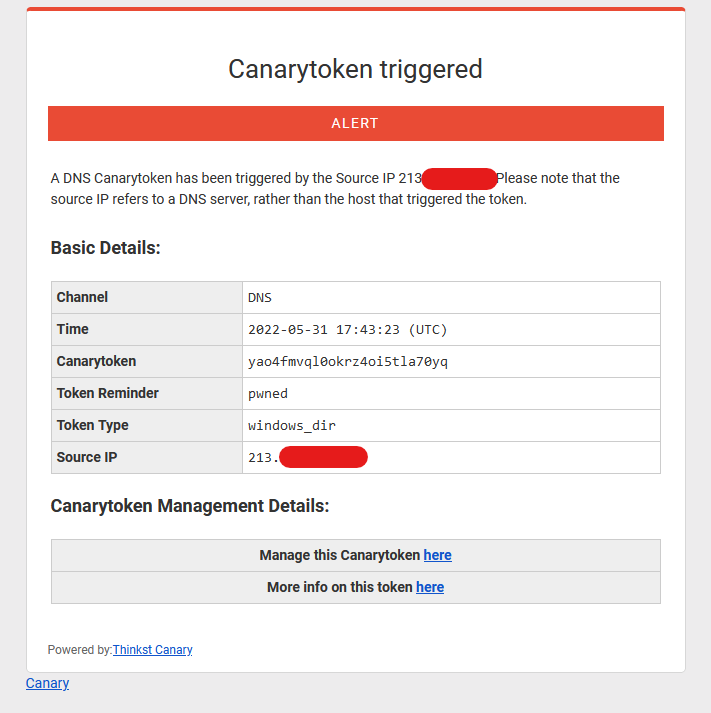

# Tokens de canário

Os canários são muito sensíveis a impurezas de gases perigosos no ar.
Portanto, por muito tempo os mineiros os levaram consigo para as minas:
se o pássaro parasse de cantar, significava que se tornava perigoso respirar o ar.

Um princípio semelhante é usado na Internet. Muitas
empresas usam notificação ao usuário:
que ninguém está observando eles, para que quando receberem uma ordem judicial
para *remover* essa frase. Assim, a empresa dá um sinal aos usuários
que a ausência de vigilância não é mais garantida.

Não vamos nos esconder das corporações, mas das pessoas curiosas.
O que podemos fazer?

## Tokens de canário

Você pode ter visto links na biografia na página VK que
não levam a lugar nenhum (ou levam ao aplicativo "Descubra quem está espionando você" ou
algo assim). Esta é a forma mais simples de um canário.

Existe um maravilhoso serviço online - Canary Tokens, que permite criar seus próprios canários.

Ele permite criar vários tipos de canários que podemos usar para detectar funcionários curiosos de sua organização ou detectar o comprometimento de seus sistemas mesmo antes que um invasor possa realizar algumas ações destrutivas.

Quais tipos podem ser gerados e em quais condições a notificação será recebida:
- Token URL. Ao clicar no link.
- Token DNS. Quando o nome do domínio é resolvido.
- Chaves AWS. Ao usar uma chave AWS.
-  Documento Microsoft Word/Excel. Ao abrir o arquivo.
-  Kubeconfing. Ao usar Kubeconfig.
-  VPN WireGuard. Ao usar a configuração.
-  Site Clonado. Ao clonar um site.
-  Dump MySQL. Ao carregar um dump MySQL.
-  Pasta do Windows. Ao tentar abrir uma pasta.
-  Redirecionamento Rápido. Ao tentar visitar o site, seguido por redirecionamento.
-  Redirecionamento Lento. Ao tentar visitar o site, seguido por um redirecionamento lento, para obter mais informações.
-  Bug da Web de Imagem Personalizada. Ao visualizar sua imagem.
-  Documento PDF do Acrobat Reader. Ao abrir um documento PDF no Adobe Reader.
-  exe / binário personalizado. Ao executar arquivos executáveis.
-  SQL Server. Ao carregar o banco de dados do SQL Server.
-  SVN. Ao abrir a pasta SVN.
-  Endereço de e-mail único. Ao enviar correio para um endereço de e-mail.

Exemplo de notificação por e-mail:

*A seção será atualizada*

## Diferença entre links de phishing e logger

*A seção será atualizada*

---

[⬅️ Anterior](./11-fonte-de-vazamentos.md) | [⏫ Tabela de conteúdos](../README.md) | [Próximo ➡️](13-violacoes-inuteis.md)